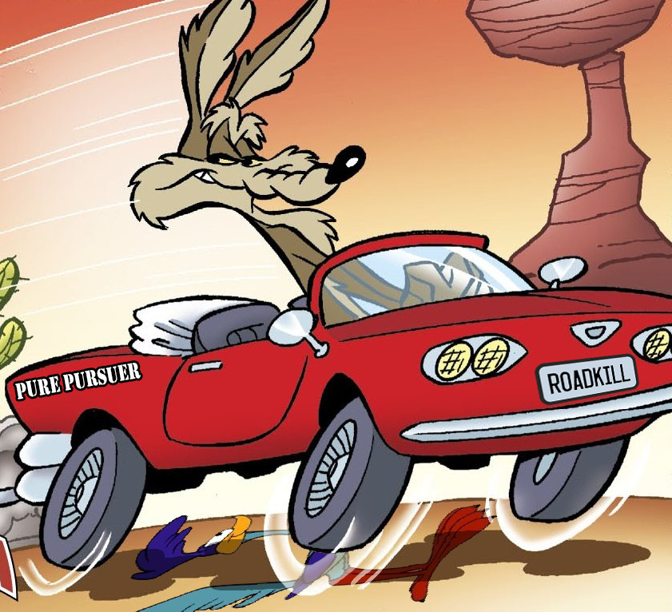
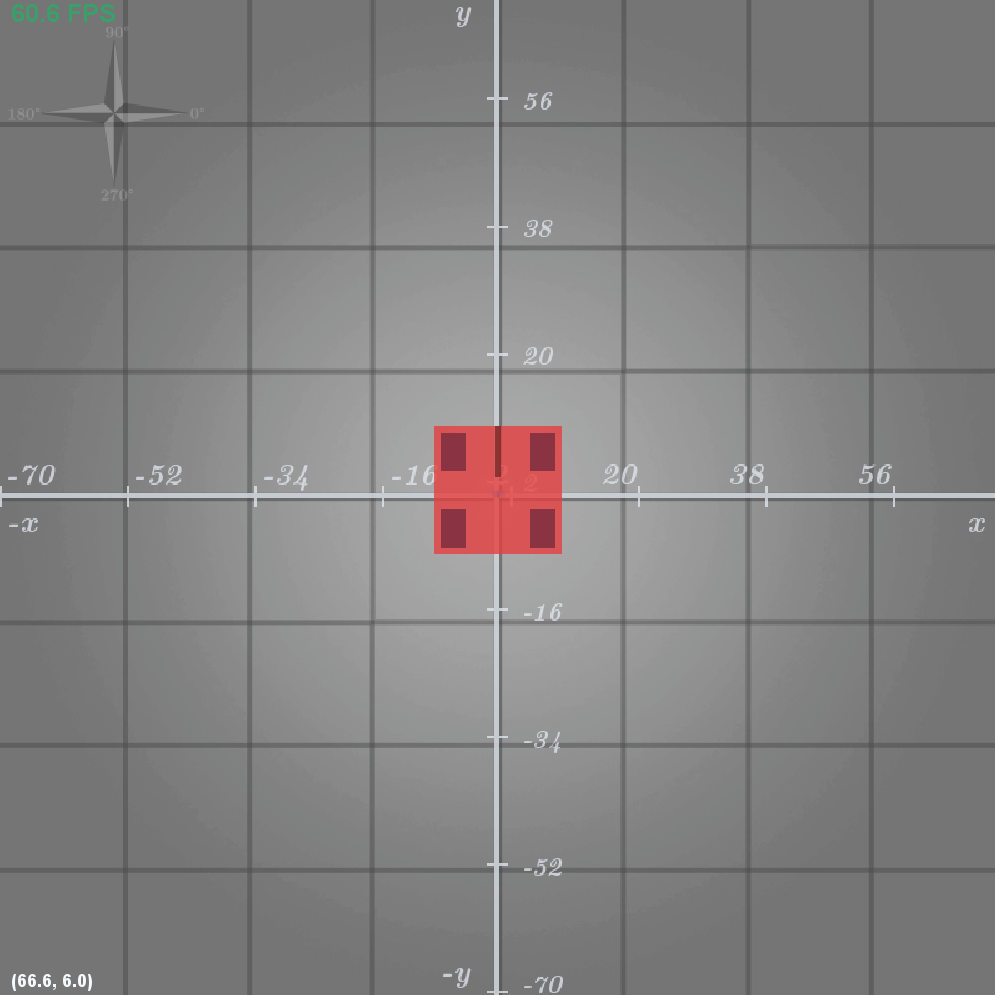
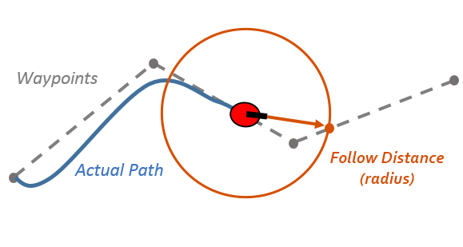
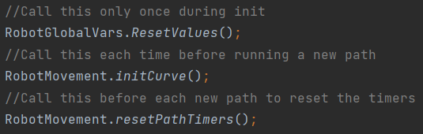
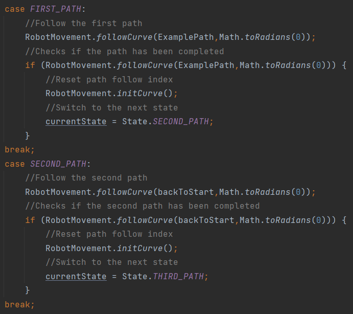
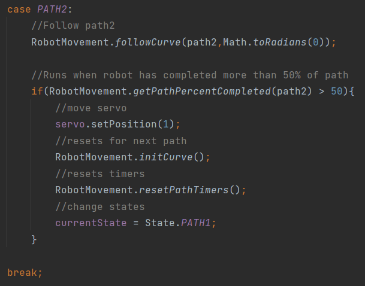

 
<h1 align=center><b>——— RoadKill ———
</b></h1>

---

<h3 align=center>
By Team 4707 Midway Predators (adapted from team 11115 Gluten Free)
</h3>

RoadKill is a versatile pure pursuit solution for teams that already use RoadRunner on their FTC robot.

## Installation

- Either clone or download this repo and place the **purePursuit** folder into your **teamcode** folder of your Android Studio project
- The code will then be able to be used in every OpMode

## Setup

- Before using this library, make sure all **RoadRunner** values are fully tuned except for the PID's
- You must also be using **dead wheel odometry** to ensure accurate localization -- other sensor-based localization methods can work as well, however a current limitation of this library is that it must use a localizer

## Coordinate System
- Unlike RoadRunner, this library uses a regular coordinate grid - one that's **not rotated by 90 degrees**
- This image below represents the orientation of the coordinate system relative to the robot's starting pose

MeepMeep Visualizer

## Building Paths

- Paths are generated based on a waypoint system that is contained inside of an array
>
- Each waypoint contains information on how the robot will behave as it is travelling between it and a next point
- This information is stored in a CurvePoint class that accepts 10 different values:
---
>`CurvePoint(targetXPos, targetYPos, moveSpeed, turnSpeed, followDistance, pointLength, slowDownTurnRadians, slowDownTurnAmount, globalAngleLock, individualFollowAngle);`
---

<h3>
The table below explains what each value does:
</h3>

| Value| Description |
| ----------- | ----------- |
| targetXPos | X position of the end point|
| targetYPos | Y position of the end point|
| moveSpeed | Translational speed of the robot|
| turnSpeed | Angular speed of the robot|
| followDistance | Distance the robot "looks ahead" of its current position **for position**|
| pointLength | Distance the robot "looks ahead" of its current position **for rotation**|
| slowDownTurnRadians | Slows the robot down when it rotates more than the specified amount|
| slowDownTurnAmount | Scale factor for the turn slowdown|
| globalAngleLock | When **true**, locks the robot's angle to a specified one, when **false**, robot's angle is determined by the path and an optional specified offset|
| individualFollowAngle | Angle for the robot to face as it's tracking towards this particular point. When globalAngleLock is **false**, the target angle is equal to the current path angle plus this value. When globalAngleLock is **true**, this value determines robot global angle|

- **NOTE:** A larger followDistance and pointLength will mean that the robot will track a point further in front of it. This will cause it to cut corners more and decrease path following accuracy while increasing the follow speed. Large followDistance and pointLength values are reccomended for long paths whereas smaller values are reccomended for short, precise paths
- When creating a path to follow, it's important to always start the path at the robot's current position *(default position here is 0,0)*
- This will ensure that the robot will start following right on the path and mitigate the risk of the robot being off of the path completely *(follow radius cannot see path segment)*

## Running Paths
- To follow a path, call this line in a loop:

`RobotMovement.followCurve(<pathName>, Math.toRadians(<degreeOffset>);`

- The **degreeOffset** allows you to add an angle offset to the current path angle. The default is 0 (robot will always face forward on the path) but it could, for example, be changed to 180 degrees to make the robot drive backwards
- Once the robot is done following the path, it will slow down and come to rest at the last point in the array

## OpMode Setup
- In order to use RoadKill in an OpMode, some special considerations need to be taken
- RoadKill or more specifically, the **RobotMovement** class needs to be able to see important robot global variables in order to process information
- This class pulls information from the **RobotGlobalVars** class related to position, rotation, velocity, and motor power so **RobotGlobalVars** should always be updated with the latest information
- Assume that we have set up a SampleMecanumDrive hardware map under the name "drive"
- This must be called continuously to ensure the drive motor powers are calculated correctly

`RobotMovement.updateAlgorithm(drive);`

- The next lines have to be called at the beginning of the OpMode during init
- `RobotMovement.initCurve();` has to be called before running each path though

## State Machines
- Since `RobotMovement.followCurve();` must be constantly called in a loop, state machines are a must-have when using this library
- They will allow for separate loops to be ran in the background for automating tasks such as moving motor/servos for scoring
- State machines will also allow for easy chaining of paths due to how the end-of-path detetction method works
- An Enum-based switch statement state loop will work fine for this

### Path Chaining
- Once the robot has reached the end goal in a path, the function used to follow the path will return true
- This will instantly update and there will be no pause, so motors might still be moving
- Below shows how a path can be chained through the use of a state machine

- For the greatest success when chaining paths, have the second one start at the coordinate where the first one ends
- **NOTE:** pure pursuit typcially does not work well when a single path intersects itself. It will usually try to find the "best solution" so it may cut out entire path segments if there is an intersection
- Chaining paths can solve this as when following a path, it only looks for points on the current path and not an older one
- An example OpMode that uses state machines is included as well

## Path Triggers

- Path triggers are useful for if you want an action to happen at a certain point while following a path
- The RobotMovement class includes several methods that can return useful information about the robot during a path

| Method | Description |
| ----------- | ----------- |
| getPathPercentCompleted | Returns the percent of the entire path that the robot has completed |
| getPathSegmentPercentCompleted | Returns the percent of the specified path segment that the robot has completed|
| getPathTimerSeconds | Returns the time in seconds that the robot has been following the path for |
| getPathSegmentTimerSeconds | Returns the time in seconds that the robot has been following the current path segment for |
| getCurrentPathSegmentIndex | Returns the index of the current waypoint that the robot is heading towards |

- Here is an example of getPathPercentCompleted in code:

## Additional Features
### Path Planning TeleOp

- This OpMode tracks the robot's roadrunner coordinates and roadkill pure pursuit coordinates as well as rotation
- Data from this program can easily be used to determine waypoint coordinates when making an autonomous program
- Make sure to use the pure pursuit value for waypoints and not the roadrunner one!

### Dynamic Progress Bar Telemetry

- This method will return a string output of a progress bar correlating to the percent value inputted into it:

`MathFunctions.progressBarString(<percent>);`

- This can be used as a visual indicator to know when in a path to apply a path trigger